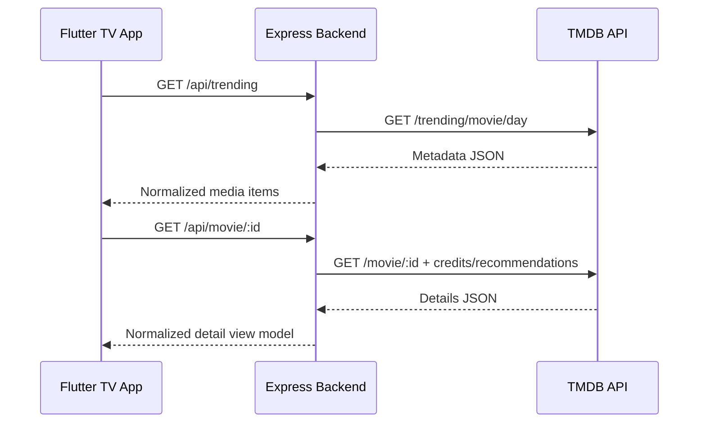
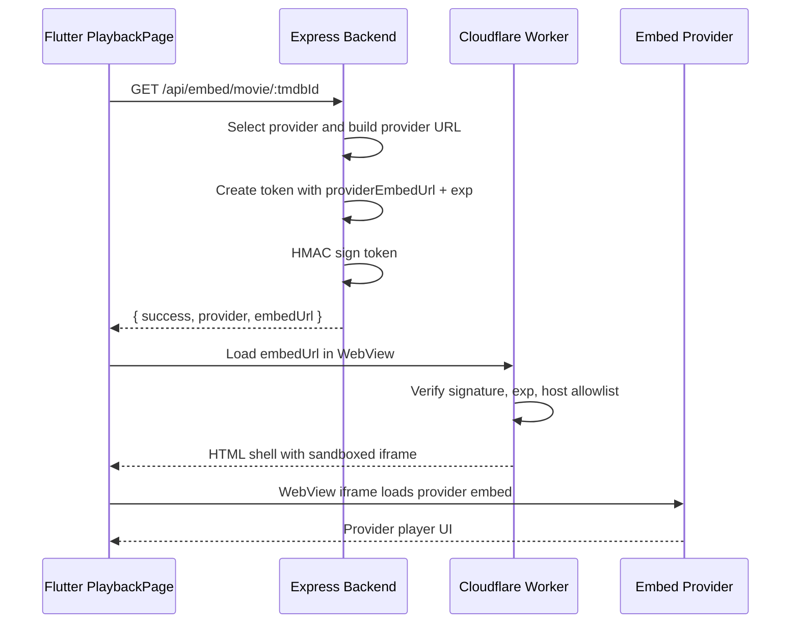
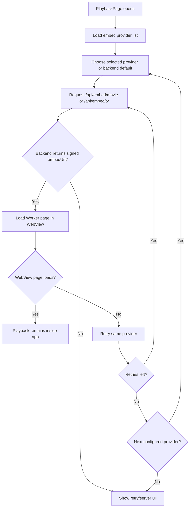

# OCAMPOFLIX Clean Architecture

OCAMPOFLIX is a Netflix-style Flutter TV app backed by an Express metadata API, TMDB for catalog data, a provider abstraction for embed pages, and a Cloudflare Worker iframe gateway for playback. The current architecture intentionally avoids direct HLS extraction, playlist parsing, native HLS playback, and provider-specific stream resolver complexity.

## 1. Final Folder Structure

```text
movieapp/
  backend/
    src/
      app.js                         Express app wiring
      server.js                      Local server entrypoint
      config/
        env.js                       Backend environment parsing
        embedProviders.js            Provider registry, ordering, URL patterns
      controllers/
        catalogController.js         TMDB catalog/detail endpoints
        embedController.js           Embed provider and playback endpoints
      middleware/
        cacheHeaders.js              HTTP cache policy
        errorHandler.js              API error normalization
        rateLimiter.js               Backend rate limiting
        validate.js                  Request validation
      routes/
        catalogRoutes.js             TMDB metadata routes
        embedRoutes.js               /embed provider/playback routes
        index.js                     /api route composition
      services/
        tmdbService.js               TMDB fetch/cache/format service
        embedService.js              Provider URL generation and Worker signing
      utils/
        asyncHandler.js
        cache.js
        responseFormatter.js
    .env.example
    package.json

  frontend/
    lib/
      app.dart
      main.dart
      core/
        constants/
          api_endpoints.dart         Backend API paths
          app_constants.dart         Backend base URL and app constants
        navigation/                  TV focus/navigation helpers
        network/dio_client.dart      Dio backend client
        responsive/                  TV/mobile layout sizing
      features/
        home/
        catalog/
        details/
        playback/
          playback_page.dart         WebView embed player and mitigation layer
        search/
        my_list/
        profiles/
        settings/
        splash/
      models/
        media_item.dart
        media_details.dart
        embed_source.dart            Embed response/provider/season models
      providers/
        catalog_providers.dart       Riverpod metadata/embed providers
      services/
        api_service.dart             JSON API wrapper
        catalog_repository.dart      Metadata repository
        embed_repository.dart        Embed playback repository
        local_library_repository.dart
      shared/widgets/
      theme/
    android/
    pubspec.yaml

  workers/
    embed-gateway/
      worker.js                      Signed iframe gateway Worker
      README.md                      Worker deployment and security notes

  ARCHITECTURE.md                    This document
  DEPLOYMENT.md
  PRODUCTION_CHECKLIST.md
  RELEASE_WORKFLOW.md
  README.md
```

## 2. Backend Responsibilities

The backend is the only trusted server-side application the Flutter app talks to directly.

- Owns the TMDB API key and all TMDB metadata requests.
- Normalizes movie, TV, season, search, recommendation, and genre responses.
- Caches metadata responses and applies backend rate limits.
- Owns embed provider configuration in `backend/src/config/embedProviders.js`.
- Selects providers using `EMBED_PROVIDERS`, `EMBED_PROVIDER_SELECTION`, health scores, enabled flags, and blacklist rules.
- Builds provider embed URLs from configured movie and TV path patterns.
- Signs short-lived Cloudflare Worker URLs with `EMBED_GATEWAY_SECRET`.
- Returns only Worker embed URLs to Flutter, never raw provider URLs as the final playback target and never raw HLS playlists or segments.

Primary embed endpoints:

```text
GET /api/embed/providers
GET /api/embed/movie/:tmdbId?provider=env-2
GET /api/embed/tv/:tmdbId/:season/:episode?provider=env-2
```

Example response:

```json
{
  "success": true,
  "provider": "VidLink",
  "embedUrl": "https://embed-gateway.example.workers.dev/embed?token=...&signature=..."
}
```

## 3. Frontend Responsibilities

Flutter owns the TV experience and treats playback as a signed web embed.

- Renders Netflix-style catalog, details, search, rails, profile, settings, My List, and Continue Watching UI.
- Calls only backend `/api` endpoints for metadata and playback.
- Uses `EmbedRepository` to request signed Worker embed URLs.
- Loads `embedUrl` in `flutter_inappwebview` inside `PlaybackPage`.
- Keeps playback inside the app by blocking external browser launches and top-level redirects.
- Supports Android TV focus, back/select keys, fullscreen landscape mode, retry, reload, and provider switching.
- Applies WebView mitigation:
  - `shouldOverrideUrlLoading`
  - `shouldInterceptRequest`
  - `onCreateWindow`
  - content blockers
  - document-start JavaScript popup suppression
  - safe overlay cleanup and obvious close-button clicks

Flutter does not:

- Extract provider HTML.
- Parse JavaScript player config.
- Parse `.m3u8` playlists.
- Resolve subtitles or segments.
- Play HLS with native video player controls.
- Sign Worker tokens.

## 4. Cloudflare Worker Responsibilities

The Worker is an iframe gateway and security shell.

- Receives `/embed?token=...&signature=...`.
- Verifies HMAC-SHA256 signature using `EMBED_GATEWAY_SECRET`.
- Rejects expired or malformed tokens.
- Validates provider URLs against `ALLOWED_PROVIDER_HOSTS`.
- Rejects local/private/credentialed/non-HTTPS provider URLs.
- Renders minimal HTML containing the provider iframe.
- Adds iframe sandbox, `allow`, optional iframe `csp=""`, and `referrerpolicy="no-referrer"`.
- Adds response security headers:
  - `Content-Security-Policy`
  - `Referrer-Policy: no-referrer`
  - `Permissions-Policy`
  - `X-Content-Type-Options`
  - `X-Robots-Tag`
  - `Cache-Control: no-store`
- Optionally rate limits by IP using `RATE_LIMIT_KV`.

The Worker cannot make the iframe `src` invisible to a determined user inspecting browser/WebView internals. Its job is to remove provider URLs from Flutter/backend JSON contracts, centralize validation, reduce referrer leakage, and constrain the player page.

## 5. Request Flow Diagram



## 6. Playback Flow Diagram



## 7. Provider Fallback Flow



Provider selection inputs:

- Backend allowlist: `EMBED_PROVIDERS=env-2,env-9,env-10`
- Preferred provider query: `?provider=env-2`
- Provider enabled flags: `AUTHORIZED_EMBED_PROVIDER_N_ENABLED`
- Health scores: `EMBED_PROVIDER_ENV_N_HEALTH_SCORE`
- Blacklist: `EMBED_PROVIDER_BLACKLIST`
- Strategy: `EMBED_PROVIDER_SELECTION=random` or `best-health`

## 8. Security Model

Trust boundaries:

- Flutter is untrusted for secrets. It never receives TMDB keys or signing secrets.
- Backend is trusted to call TMDB, select providers, and sign Worker tokens.
- Worker is trusted to verify tokens and render the iframe shell.
- Provider pages are untrusted cross-origin content loaded in a sandboxed iframe/WebView.

Controls:

- Backend CORS and rate limiting protect API access.
- TMDB API key stays server-side.
- Provider switching is centralized in backend config.
- Worker token includes expiration (`exp`) and is signed with HMAC-SHA256.
- Worker validates allowed provider hosts.
- Worker rejects private/local targets to reduce SSRF-style abuse.
- Worker sends no-referrer policy and no-store caching.
- Worker iframe sandbox excludes popup and top-navigation capabilities by default.
- Flutter blocks popup windows through `onCreateWindow`.
- Flutter blocks external schemes and top-level navigation away from the Worker embed page.
- Flutter blocks known ad/tracker hosts and common ad URL patterns.
- Flutter injects defensive JavaScript to suppress `window.open`, remove `_blank` targets, and clean obvious overlays.

Operational caveats:

- Embed providers may require JavaScript, same-origin iframe semantics, forms, or presentation APIs; sandbox changes must be tested per provider.
- Aggressive blocking can break some provider players. Start strict, then loosen only for specific trusted providers.
- Do not put `EMBED_GATEWAY_SECRET`, TMDB keys, or provider administration credentials in Flutter.

## 9. Deployment Checklist

Backend:

- Set `TMDB_API_KEY`.
- Set `EMBED_GATEWAY_BASE_URL` to the deployed Worker origin.
- Set `EMBED_GATEWAY_SECRET` to the same value configured in the Worker.
- Configure provider base URLs and patterns.
- Configure `EMBED_PROVIDERS` ordering.
- Run `npm install`.
- Run backend checks/tests.
- Deploy to Vercel or your Node hosting target.
- Verify `/health`, `/api/trending`, `/api/embed/providers`, and one movie/TV embed endpoint.

Worker:

- Deploy `workers/embed-gateway/worker.js`.
- Set `EMBED_GATEWAY_SECRET`.
- Set `ALLOWED_PROVIDER_HOSTS` to match backend provider hosts.
- Optionally bind `RATE_LIMIT_KV`.
- Optionally configure `ALLOWED_FRAME_ANCESTORS`.
- Test `/embed` with a real backend-generated URL.

Frontend:

- Set backend base URL in `frontend/lib/core/constants/app_constants.dart` or the active backend config file.
- Run `flutter pub get`.
- Run `flutter analyze`.
- Build Android TV APK or app bundle.
- Sideload on Android TV.
- Test movie playback, TV playback, retry, reload, provider switch, remote back/select, and fullscreen behavior.

## 10. Environment Variables

Backend:

| Variable | Purpose |
| --- | --- |
| `PORT` | Local Express port |
| `TMDB_API_KEY` | Server-side TMDB API key |
| `TMDB_BASE_URL` | TMDB API base URL, normally `https://api.themoviedb.org/3` |
| `ALLOWED_ORIGINS` | Backend CORS origins |
| `CACHE_TTL_SECONDS` | Fresh metadata cache TTL |
| `STALE_CACHE_TTL_SECONDS` | Stale metadata cache TTL |
| `RATE_LIMIT_WINDOW_MS` | Backend rate limit window |
| `RATE_LIMIT_MAX` | Backend max requests per window |
| `REQUEST_TIMEOUT_MS` | Upstream TMDB timeout |
| `EMBED_GATEWAY_BASE_URL` | Cloudflare Worker base URL |
| `EMBED_GATEWAY_SECRET` | Shared backend/Worker HMAC secret |
| `EMBED_TOKEN_TTL_SECONDS` | Signed embed URL TTL |
| `EMBED_PROVIDER` | Optional preferred provider id |
| `EMBED_PROVIDERS` | Provider allowlist/order |
| `EMBED_PROVIDER_SELECTION` | `random` or `best-health` |
| `EMBED_PROVIDER_BLACKLIST` | Provider ids/names to suppress |
| `CUSTOM_EMBED_*` | Custom provider name/base/patterns |
| `AUTHORIZED_EMBED_PROVIDER_N_*` | Provider name/base/patterns/enabled config |
| `EMBED_PROVIDER_ENV_N_HEALTH_SCORE` | Provider ranking score |

Worker:

| Variable / Binding | Purpose |
| --- | --- |
| `EMBED_GATEWAY_SECRET` | Shared HMAC secret |
| `EMBED_TOKEN_MAX_AGE_SECONDS` | Maximum accepted token age |
| `ALLOWED_PROVIDER_HOSTS` | Comma-separated provider host allowlist |
| `ALLOWED_FRAME_ANCESTORS` | CSP frame ancestors for Worker page |
| `IFRAME_SANDBOX` | Override default iframe sandbox |
| `IFRAME_ALLOW` | Override default iframe allow policy |
| `IFRAME_CSP_ENABLED` | Enable iframe `csp=""` attribute |
| `IFRAME_CSP` | Optional embedded iframe CSP |
| `RATE_LIMIT_MAX` | Worker requests per IP per minute |
| `RATE_LIMIT_KV` | Optional Cloudflare KV namespace binding |

Frontend:

| Setting | Purpose |
| --- | --- |
| `backendBaseUrl` | Flutter API base URL under `/api` |
| Android signing props | Release signing configuration |

## 11. Scaling Recommendations

Backend:

- Keep TMDB response caching enabled.
- Add a shared cache such as Redis/Upstash if multiple backend instances need consistent cache behavior.
- Track provider health and lower scores for providers that fail frequently.
- Keep embed token TTL short, usually 5-15 minutes.
- Add structured logs for provider id, media type, status, and latency without logging signed URLs.

Worker:

- Use Cloudflare KV or Durable Objects for stronger abuse controls if traffic grows.
- Keep `ALLOWED_PROVIDER_HOSTS` minimal.
- Consider per-provider Worker routes only if a provider needs special sandbox/CSP exceptions.
- Use Cloudflare analytics and firewall rules for obvious abuse.

Frontend:

- Cache metadata, not playback URLs.
- Keep playback URL requests on-demand because signed URLs expire.
- Keep WebView mitigation lists small and conservative; overly broad blocking can break playback.
- Test on real Android TV hardware, not only desktop/mobile emulators.

## 12. Debugging Guide

Metadata fails:

- Check `TMDB_API_KEY`.
- Hit `/health`.
- Hit `/api/trending?page=1`.
- Check backend logs for TMDB status codes and timeouts.

Embed endpoint returns `501`:

- `EMBED_GATEWAY_BASE_URL` is missing, or no provider is configured/enabled.
- Verify `EMBED_PROVIDERS` matches provider ids in `/api/embed/providers`.
- Verify provider base URLs are set.

Worker returns `401`:

- `EMBED_GATEWAY_SECRET` differs between backend and Worker.
- Token expired.
- Backend and Worker clocks are far apart.

Worker returns `403`:

- Provider host is not in `ALLOWED_PROVIDER_HOSTS`.
- Backend generated a provider URL on a subdomain not covered by the Worker allowlist.

WebView shows loading forever:

- Open the signed Worker URL in a desktop browser and inspect console/network.
- Check whether the provider blocks iframe/WebView user agents.
- Temporarily loosen iframe sandbox for that provider only and retest.
- Check Flutter `shouldOverrideUrlLoading` and blocked host list for false positives.

Provider opens ads/popups:

- Confirm `supportMultipleWindows=false`.
- Confirm `onCreateWindow` returns `false`.
- Add only the specific ad host to `_blockedHostSuffixes`.
- Avoid broad keyword blocks that may match provider player scripts.

Android TV controls feel stuck:

- Verify `PlaybackPage` has focus.
- Test remote Back, Select, Enter, and D-pad.
- Confirm overlay controls are not permanently hidden by a loading/error state.

## 13. Migration Notes From Old HLS Architecture

Removed concepts:

- Direct HLS native playback.
- BetterPlayer dependency and vendored package.
- `.m3u8` URL validation in Flutter.
- Stream source models with `streamUrl`, `referer`, and subtitles.
- Provider HTML parsers and stream resolver logic.
- HLS playlist, segment, subtitle, and audio-track handling in the app.

New concepts:

- `EmbedSource` model with `embedUrl` and `provider`.
- `EmbedRepository` calling `/api/embed/...`.
- `PlaybackPage` using `flutter_inappwebview`.
- Backend provider abstraction that builds provider embed URLs.
- Cloudflare Worker signed iframe gateway.

Deprecated/unused:

- Legacy HLS proxy code has been removed and is not part of the clean playback path.
- Old `/stream/*` endpoint references in older deployment docs should be replaced with `/embed/*`.

Migration checklist:

- Replace frontend stream imports with embed imports.
- Replace `/stream/providers` with `/embed/providers`.
- Replace `/stream/movie/:id` with `/embed/movie/:id`.
- Replace `/stream/tv/:id/:season/:episode` with `/embed/tv/:id/:season/:episode`.
- Remove BetterPlayer/native video player usage.
- Keep provider URLs server-side.
- Ensure Flutter loads only the Worker `embedUrl`.

Final result:

```text
TMDB metadata -> Express API -> Flutter catalog/details
Provider config -> Express embed signer -> Cloudflare Worker page -> Flutter WebView playback
```

The architecture now optimizes for maintainability and provider switching: playback remains centralized behind backend provider configuration and a Worker gateway, while Flutter stays focused on a polished TV app experience.
